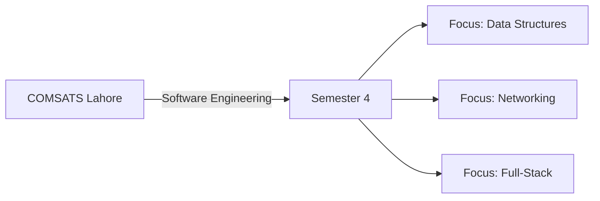

<!-- ──────────────────────────────────────────────────────────── -->
<!--              MUHAMMAD ZEESHAN — SYSTEMS ENGINEER             -->
<!-- ──────────────────────────────────────────────────────────── -->

<!-- ═══════════ INTERSTELLAR HEADER ═══════════ -->

<!-- ═══════════ DYNAMIC STATUS BAR ═══════════ -->
 

 

<!-- ═══════════ INTERACTIVE SPACE GRID ═══════════ -->
<picture>
  <source media="(prefers-color-scheme: dark)" srcset="https://raw.githubusercontent.com/Muhammad-Zeeshan-c/Muhammad-Zeeshan-c/output/github-contribution-grid-snake-dark.svg" />
  <source media="(prefers-color-scheme: light)" srcset="https://raw.githubusercontent.com/Muhammad-Zeeshan-c/Muhammad-Zeeshan-c/output/github-contribution-grid-snake.svg" />
  
</picture>

 

<!-- ═══════════ CORE METRICS ═══════════ -->

  
  
  

 

---

## 🧬 Engineering Identity

  
  
  **I am an architect of digital logic.** Currently pursuing Software Engineering at COMSATS University Lahore, I bridge the gap between high-level user requirements and low-level system efficiency. 
  
  My expertise lies in the **MERN ecosystem**, where I build responsive, secure, and highly interactive applications. Beyond the web, I am deeply engaged in the mechanics of **AI/ML automation** and the structural integrity of **Computer Networks**.
  
  ### ⚡ System Parameters
  - **Environment:** Software Engineering (2024–2028)
  - **Directives:** Scalable Web Systems, Interactive UX, System Design
  - **In-Progress:** MERN Integration & AI/ML Explorations

 

---

## 🛰️ Technical Ecosystem

  

    
  

 

| 🏗️ Architecture | 🛠️ Development | 🌐 Infrastructure |
| :--- | :--- | :--- |
| **Frontend UI** | **Backend Logic** | **Foundations** |
| React.js / Framer | Node.js / Express | C++ / Python |
| Tailwind CSS | MongoDB / Mongoose | Cisco Networking |
| Framer Motion | Supabase | Git / Linux |

---

## 🎓 Academic Roadmap

---

## 📊 Performance Analytics

 

---

## 🏆 System Achievements

  

---

## 📉 Activity Load Distribution

| Component | Status | Intensity |
| :--- | :--- | :--- |
| **Commit Volume** | High Performance | `████████████████████` 99% |
| **Issue Resolution** | Optimized | `█░░░░░░░░░░░░░░░░░░░` 0.5% |
| **Code Governance** | Quality Control | `█░░░░░░░░░░░░░░░░░░░` 0.5% |

---

## 🧪 Experimental & Production Repos

---

## 📈 Network Connectivity

  

### 🌌 Let’s architect the future together.
**"Turning logic into life, one commit at a time."**

 

